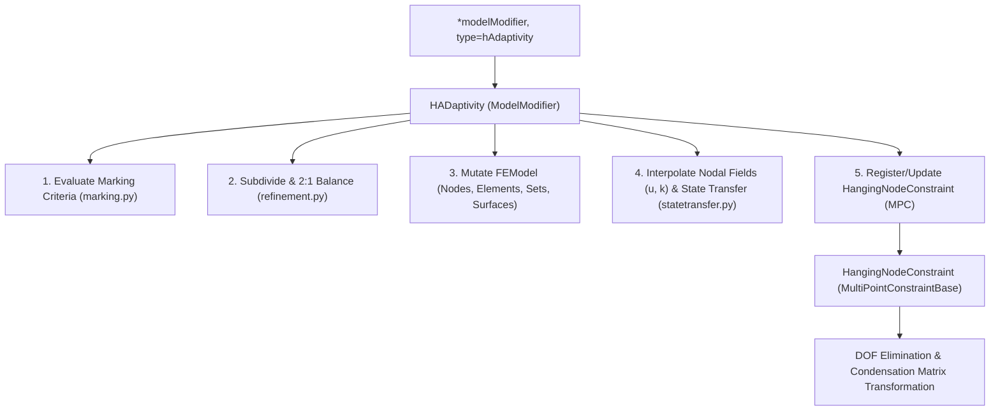
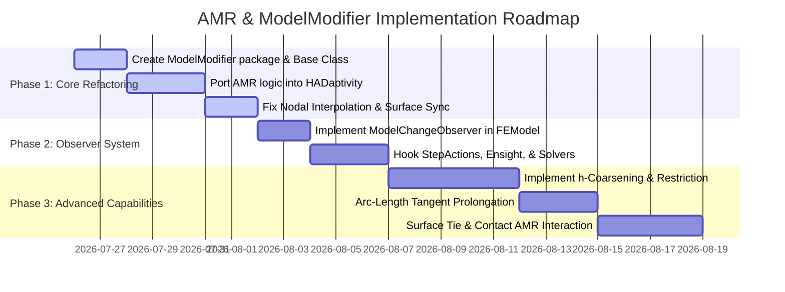

# Architectural Proposal: Next-Generation ModelModifier & Adaptivity Framework for EdelweissFE

**Repository:** `EdelweissFE`
**Target Branch:** `feat/amr-hanging-nodes` $\to$ `next_v26.11`
**Author:** Antigravity AI (DeepMind Pair Programmer)
**Date:** July 25, 2026
**Status:** Proposal / Design Specification

---

## 1. Executive Summary & Architectural Motivation

In the initial prototype on branch `feat/amr-hanging-nodes`, adaptive mesh refinement (AMR) was implemented as a zero-DOF `ConstraintBase` subclass in `edelweissfe/constraints/adaptivity.py`. While this allowed rapid proof-of-concept testing by hooking into `ConstraintBase.updateConnectivity()`, using `Constraint` for mesh adaptivity introduces major architectural drawbacks:

1. **Semantic Misalignment:** AMR is **not a kinematic constraint** (like a Dirichlet BC, surface tie, rigid body, or contact penalty). It does not compute residuals or stiffness matrices, nor does it directly constrain DOFs.
2. **Violation of Single Responsibility Principle:** Forcing topological subdivision, node creation, state-variable transfer, set/surface updates, and field allocation into a `ConstraintBase` subclass creates an unmaintainable design.
3. **Confounding Mesh Mutation with Kinematics:** In contact mechanics, `updateConnectivity()` updates facet candidate lists for a fixed mesh. In AMR, the mesh topology itself is mutated.
4. **Confusing Input Language:** Writing `*constraint, type=adaptivity` in `.inp` files is counter-intuitive for users.

To solve these issues, this proposal defines a dedicated, extensible module category: **`ModelModifier`**, accompanied by an **Observer Event Notification System (`ModelChangeEvent`)** and a complete roadmap to bring small-strain fracture AMR (`GC3D20` / `GC3D20R`) to production readiness.

---

## 2. Part 1: The `ModelModifier` Framework

### 2.1 Package & Module Hierarchy

Create a new top-level package `edelweissfe/modelmodifiers/`:

```
EdelweissFE/edelweissfe/
├── modelmodifiers/                   # <-- NEW TOP-LEVEL PACKAGE
│   ├── __init__.py
│   ├── base/
│   │   ├── __init__.py
│   │   └── modelmodifierbase.py      # Abstract Base Class
│   ├── adaptivity/
│   │   ├── __init__.py
│   │   ├── hadaptivity.py            # HEX20 h-Adaptivity Manager
│   │   ├── geometry.py               # Face geometry & bilinear inverse
│   │   ├── hex20topology.py          # Reference topology & shape functions
│   │   ├── marking.py                # Math-expression element marking
│   │   ├── refinement.py             # Octree subdivision & 2:1 balancing
│   │   └── statetransfer.py          # Nearest-QP history block copy
│   ├── elementerosion.py             # (Future) Damage-based element deletion
│   └── alemeshsmoothing.py           # (Future) Arbitrary Lagrangian-Eulerian re-meshing
```

### 2.2 Base Class Interface (`ModelModifierBase`)

File: [`edelweissfe/modelmodifiers/base/modelmodifierbase.py`](file:///home/matthias/constitutive_modeling/next_v2611/EdelweissFE/edelweissfe/modelmodifiers/base/modelmodifierbase.py)

```python
from abc import ABC, abstractmethod
from edelweissfe.models.femodel import FEModel

class ModelModifierBase(ABC):
    """Abstract base class for dynamic model mutation entities.

    Model modifiers alter mesh topology, element/node sets, material states,
    or field allocations during an analysis step.
    """

    def __init__(self, name: str, model: FEModel, **kwargs):
        self._name = name
        self._model = model

    @property
    def name(self) -> str:
        return self._name

    @abstractmethod
    def updateModel(self, model: FEModel, step, timeStep: float) -> bool:
        """Invoked by the solver at designated lifecycle hooks (e.g. start of increment).

        Returns
        -------
        bool
            True if the model topology, element/node count, or DOF system changed,
            signaling the solver to rebuild equation system structures (DofManager,
            CSR matrices, solution vectors, and MPC transformations).
        """
        pass

    def onStepStart(self, model: FEModel, step):
        """Optional lifecycle hook called at the start of an analysis step."""
        pass

    def onIncrementEnd(self, model: FEModel, step, timeStep: float):
        """Optional lifecycle hook called after an increment converges."""
        pass
```

### 2.3 Decoupled Separation of Concerns

Under this architecture, adaptivity is cleanly split into two specialized components:



1. **`HADaptivity` (`ModelModifier`):**
   * Class: `HADaptivity(ModelModifierBase)` in `modelmodifiers/adaptivity/hadaptivity.py`.
   * Responsibilities: Element marking, octree subdivision, 2:1 balancing, nodal coordinate minting, nodal field ($u, k$) interpolation, state-variable transfer, set/surface updates, and instantiating child elements.
2. **`HangingNodeConstraint` (`MultiPointConstraintBase`):**
   * Class: `Constraint(MultiPointConstraintBase)` in `constraints/hangingnode.py`.
   * Responsibilities: Enforces linear kinematic relations ($u_s = \sum N_a u_{m_a}$) via Abaqus-style DOF condensation in `DofManager`.

### 2.4 Input File Language (`.inp`)

In `edelweissfe/utils/inputfileparser.py`, register the `*modelModifier` keyword:

```abaqus
** Define dynamic h-adaptivity for gradient-enhanced damage
*modelModifier, type=hAdaptivity, name=amr_manager
result=nonlocal damage, expression=x > 0.1, reducer=absmax, maxLevel=2, elSet=concrete
```

---

## 3. Part 2: The Observer Event Notification System (`ModelChangeEvent`)

### 3.1 The Need for Event Broadcasters

When a `ModelModifier` mutates the model mid-simulation (adding/deleting nodes and elements, updating sets, changing surfaces, or altering DOF counts), downstream modules holding cached references become invalid if not notified.

| Module | Cached State | Impact if NOT Notified |
|---|---|---|
| **Step Actions** (`DirichletBC`, `DistributedLoad`, `BodyForce`) | Node lists, face-element pairs `(element, faceID)`, cached DOF indices. | New boundary nodes miss BCs; surface loads crash on deleted parent elements. |
| **Output Managers** (`Ensight`, `VTK`, `Monitor`) | Node/element counts, static geometry (`.geo` file), ID lookup tables. | Ensight variable trends reference stale node IDs; monitors miss new boundary nodes. |
| **FieldOutputs** (`fieldoutput.py`) | Per-element / per-node result arrays, element label index maps. | Marking expressions or field evaluations use out-of-date element listings. |
| **Solvers & Linear Solvers** (`NIST`, `Pardiso`, `KLU`, `AMGCL`) | `DofManager`, CSR matrix sparsity pattern, symbolic factorizations, vectors (`U`, `P`, `K`). | Matrix shape mismatches, memory corruption, or incorrect equation system solves. |

### 3.2 Observer Architecture Specification

#### 1. Observer Interface (`edelweissfe/models/modelchangeobserver.py`)

```python
from abc import ABC, abstractmethod
from enum import Enum, auto

class ModelChangeType(Enum):
    REFINEMENT = auto()        # Elements subdivided / nodes added
    COARSENING = auto()        # Elements merged / nodes removed
    ELEMENT_EROSION = auto()   # Elements deleted
    TOPOLOGY_CHANGE = auto()   # Boundary/surface set changes

class ModelChangeObserver(ABC):
    """Interface for any module that caches mesh topology, node/element references,
    or DOF indices and needs re-synchronization when the FEModel changes.
    """

    @abstractmethod
    def onModelChanged(self, model, changeType: ModelChangeType, details: dict = None):
        """Callback invoked immediately after FEModel topology or sets are mutated."""
        pass
```

#### 2. Event Publisher in `FEModel` ([`femodel.py`](file:///home/matthias/constitutive_modeling/next_v2611/EdelweissFE/edelweissfe/models/femodel.py))

```python
class FEModel:
    def __init__(self, ...):
        ...
        self._modelChangeObservers = []

    def registerObserver(self, observer: ModelChangeObserver):
        if observer not in self._modelChangeObservers:
            self._modelChangeObservers.append(observer)

    def unregisterObserver(self, observer: ModelChangeObserver):
        self._modelChangeObservers.remove(observer)

    def notifyModelChanged(self, changeType: ModelChangeType, details: dict = None):
        for observer in list(self._modelChangeObservers):
            observer.onModelChanged(self, changeType, details)
```

#### 3. Subsystem Responses

* **StepActions (`DirichletBC` / `DistributedLoad`):** Re-query `nodeSet.nodes` or `model.surfaces` and re-index target DOF indices in `DofManager`.
* **Ensight Output Manager (`ensight.py`):** Advance geometry timeset and write a fresh `.geo` trend chunk (`writeGeometryTrendChunk`) so variable trends resolve against the updated mesh connectivity.
* **Solvers (`NIST` / `Explicit` / `ArcLength`):** Flag equation system structures for immediate rebuild before proceeding to Newton iterations.

---

## 4. Part 3: Essential Bug Fixes & Refinements for Prototype

Before or alongside refactoring to `ModelModifier`, the following critical issues identified during code review must be resolved:

1. **Nodal Field ($u, k$) Interpolation on Refinement (CRITICAL):**
   * *File:* `hadaptivity.py` (`_materialize()`)
   * *Fix:* Interpolate nodal values for all new nodes from parent element shape functions ($u_{\text{new}} = \sum N_a(\xi_{\text{new}}) u_{\text{parent}, a}$) and write them into `model.nodeFields` before equation system rebuild. This will eliminate the Newton iteration spikes ($\|R\|_\infty > 25.0$) currently observed in `amr_run.log`.
2. **Model Surface Synchronization (CRITICAL):**
   * *File:* `hadaptivity.py` (`_materialize()`)
   * *Fix:* Rebuild `model.surfaces` by mapping updated surface pairs from `self._mesh.surfaces` to prevent runtime `KeyError` crashes in surface load evaluations.
3. **Parametric Coordinate State Transfer (MAJOR):**
   * *File:* `statetransfer.py` (`transferStateNearestQp`)
   * *Fix:* Replace physical distance matching with parametric octant coordinate mapping in $[-1, 1]^3$, ensuring deterministic history transfer on distorted or high-aspect-ratio hexes.
4. **Quadratic Edge Curvature Handling (MAJOR):**
   * *File:* `refinement.py` (`_lies_on_segment` and `hanging_weights`)
   * *Fix:* Extend edge classification and weight calculations to 3-node quadratic 1D geometry taking midside node `em` into account.

---

## 5. Part 4: Extended Requirements for Production Readiness

### 5.1 $h$-Coarsening (De-refinement / Un-refinement)
* **Child Merging Logic:** Merging 8 active child elements back into 1 parent element when damage/stress drops below an un-refining threshold (e.g. `expression = x < 0.01`).
* **State Restriction (Fine-to-Coarse):** Restricting internal material states from 8 child elements (64 QPs for `GC3D20R`) into 1 parent element (8 QPs) via volumetric averaging or $L_2$ projection.
* **Coarsening 2:1 Balance Rules:** Ensuring coarsening does not violate the 2:1 face-adjacency invariant with neighboring active elements.

### 5.2 Arc-Length Solver Tangent Vector Prolongation
* In snap-back fracture simulations, Arc-Length solvers (`arclength.py`) maintain a predictor tangent vector $V = [\Delta U; \Delta \lambda]$ of dimension $N_{\text{old}} + 1$.
* Upon refinement, $V$ must be **prolongated onto the new DOF space** ($N_{\text{new}} + 1$) via shape function interpolation and re-orthogonalized to prevent arc-length step corruption.

### 5.3 Linear Solver Handle & Symbolic Factorization Resets
* Linear solvers (**Pardiso**, **KLU**, **AMGCL**) perform symbolic factorizations based on the CSR sparsity pattern.
* Reusing stale factorizations on a modified CSR pattern leads to segfaults or numerical corruption. Solvers must explicitly execute symbolic handle resets (`pardiso_free()`, `klu_free()`) upon `ModelChangeEvent`.

### 5.4 Complex Constraint Interactions (Surface Ties & Contact)
* **Surface Ties (`*tie`):** When master or slave faces on a surface tie undergo AMR, tie condensation weights and projections must be automatically re-evaluated.
* **Deformable Contact Facets:** Surface facet elements (`Tria3ContactFacet`) must be re-triangulated when underlying solid hex faces subdivide.

### 5.5 Analytical Fields on New Boundary Nodes
* Boundary nodes created by AMR on Dirichlet boundaries using `AnalyticalField` functions (e.g. $u_z(x,y,z) = \sin(x)\cos(y)$) must evaluate prescribed values directly from the analytical function rather than linear corner interpolation.

### 5.6 Checkpoint / Restart & Mesh Export (`*restart`)
* **HDF5 / JSON Checkpoint Serialization:** Serialize `AdaptiveMesh` octree trees, node registry, and MPC records so refined simulations can be resumed from disk.
* **Exodus / VTK Export:** Export adapted mesh topology and field outputs for visualization in external tools (ParaView, Cubit).

---

## 6. Part 5: Implementation Roadmap



### Milestone Schedule:
1. **Milestone 1 (ModelModifier Refactoring & Critical Bug Fixes):** Create `edelweissfe/modelmodifiers/`, implement `HADaptivity`, fix nodal solution interpolation $u, k$ and surface sync.
2. **Milestone 2 (Observer Notification System):** Implement `ModelChangeObserver` in `FEModel`, connect StepActions, Ensight output manager, and solvers.
3. **Milestone 3 (Coarsening & Arc-Length Integration):** Implement $h$-coarsening, state restriction, and arc-length predictor vector prolongation.
