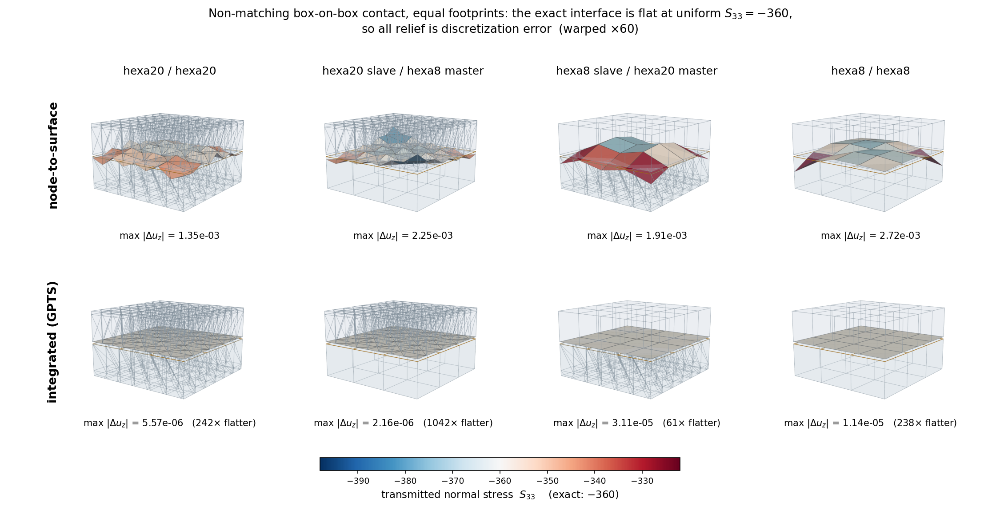
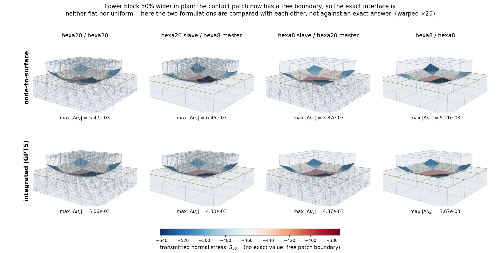

Contact mechanics: theory
=========================

This page documents the theory of the node-to-deformable-surface contact stack implemented in
EdelweissFE: the discretization of contact surfaces into flat facets
(:mod:`~edelweissfe.elements.contactsurfaceelement`,
:mod:`~edelweissfe.generators.surfaceelementgenerator`), the gap kinematics in their finite-sliding
and small-sliding variants (:mod:`~edelweissfe.utils.facetcontactgeometry`,
:mod:`~edelweissfe.constraints.nodetodeformablesurfacepenalty`), the penalty and augmented-Lagrange
normal contact laws, Coulomb friction, and the integration into the implicit solver. Every formula
stated here is implemented literally in the referenced modules and has been verified against
independent finite differences, symbolic differentiation, or analytic benchmark solutions; the
verification methodology is summarized at the end.

The stack targets *small-deformation* applications with possibly *large relative sliding* along the
interface (e.g. anchorage problems: steel anchors in concrete channels, friction-dominated
capacity, curved bearing surfaces, quadratic solid elements).

Formulation
-----------

The contact mechanics itself: how the gap is measured, what force answers it, and how friction is integrated. None of this is particular to EdelweissFE.

Gap kinematics
~~~~~~~~~~~~~~

Throughout, :math:`\boldsymbol{x}_s` denotes the current position of a slave node and
:math:`\boldsymbol{x}_a,\; a = 1 \ldots k` the current positions of the assigned master facet's
nodes (:math:`k = 3` for Tria3, :math:`k = 2` for Line2). The generalized coordinate vector of
one contact pair is :math:`\boldsymbol{q} = [\boldsymbol{x}_s, \boldsymbol{x}_1, \ldots,
\boldsymbol{x}_k]`.

.. _finite-sliding-kinematics:

Finite sliding: exact gap, gradient, and Hessian
^^^^^^^^^^^^^^^^^^^^^^^^^^^^^^^^^^^^^^^^^^^^^^^^

In the finite-sliding formulation (``sliding=finite``), the gap and its exact first and second
derivatives are recomputed from the *current Newton iterate* in every iteration -- no geometry is
frozen within an increment.

For a Tria3 facet, the unit normal is constructed by cross-product-then-normalize,

.. math::

   \boldsymbol{c} = (\boldsymbol{x}_2 - \boldsymbol{x}_1) \times (\boldsymbol{x}_3 -
   \boldsymbol{x}_1), \qquad m = \lVert \boldsymbol{c} \rVert, \qquad \boldsymbol{n} =
   \boldsymbol{c} / m,

and the gap is the signed plane distance

.. math::

   g(\boldsymbol{q}) = \boldsymbol{n} \cdot (\boldsymbol{x}_s - \boldsymbol{x}_1),

positive outside the facet's half-space, negative when penetrating. (In 2D, :math:`\boldsymbol{n}`
is the edge direction rotated by :math:`-90^\circ` and normalized, consistent with a
counter-clockwise traversal of the solid's boundary.)

The gradient :math:`\boldsymbol{w} = \partial g / \partial \boldsymbol{q}` follows from the chain
rule with

.. math::

   \frac{\partial \boldsymbol{n}}{\partial \boldsymbol{x}_a} = \frac{1}{m} \left( \boldsymbol{I}
   - \boldsymbol{n} \otimes \boldsymbol{n} \right) \frac{\partial \boldsymbol{c}}{\partial
   \boldsymbol{x}_a},

where :math:`\partial \boldsymbol{c} / \partial \boldsymbol{x}_a` are constant skew-symmetric
(cross-product) matrices of the edge vectors. Because the facet is flat, the *only* second-order
term in the Hessian :math:`\boldsymbol{H} = \partial^2 g / \partial \boldsymbol{q}^2` is the
pose-dependence of the normal's own construction (the derivative of the
normalize-the-cross-product map) -- there is **no curvature term**. The closed forms comprise
three contributions per node-pair block: the derivative of the tangent-plane projector, the
derivative of the skew arguments, and the derivative of the normalization denominator. They were
derived by hand and cross-verified against exact symbolic differentiation (SymPy) and independent
central finite differences to machine precision at many random non-degenerate configurations; see
the warning in :mod:`~edelweissfe.utils.facetcontactgeometry` -- this normalize/rotate
second-derivative algebra is very easy to get subtly wrong, and the module must not be hand-edited
without re-verification.

The slave is assigned to its single closest facet (by facet centroid distance) once per
connectivity update -- every increment in an implicit analysis, less often under explicit dynamics
(see :ref:`contact-explicit-dynamics`) -- from the last converged configuration. Within the
increment, an exact in-facet containment test
(barycentric for Tria3, parametric for Line2) gates the contribution: if the projection of the
slave leaves the assigned facet mid-Newton, no contact is assembled for that slave until the next
connectivity update. Two non-smoothness sources follow: the facet-normal snap when the closest
point crosses a facet seam, and the mid-increment containment loss ("dead zones" at facet edges
and corners, where a penetrating node can temporarily carry no force). Both are accepted
limitations of this formulation -- and both *vanish identically* in the small-sliding formulation,
which is the recommended one for the target applications.

.. _small-sliding-kinematics:

Small sliding: frozen closest-point projection
^^^^^^^^^^^^^^^^^^^^^^^^^^^^^^^^^^^^^^^^^^^^^^

In the small-sliding formulation (``sliding=small``, in the sense of the classical
"small-sliding" contact of implicit FE codes), the closest-point projection of each slave onto
the master surface is computed once per increment from the last converged configuration and
**frozen for all Newton iterations of that increment**:

1. For every master facet, the true closest point of the *closed* facet domain is computed --
   interior, edge, or vertex -- via the barycentric region classification (Ericson's real-time
   collision detection test), yielding clamped, non-negative weights
   :math:`\bar{N}_a \geq 0,\; \sum_a \bar{N}_a = 1`. The facet with the smallest true distance is
   assigned. Because the *closed* domain is used, there is no dead zone at facet seams: a node
   beyond a facet's edge clamps to that edge or vertex and remains loadable.

2. The assigned facet's unit normal :math:`\bar{\boldsymbol{n}}` and the clamped weights
   :math:`\bar{N}_a` are frozen. The gap of the current iterate is then

   .. math::

      g(\boldsymbol{q}) = \bar{\boldsymbol{n}} \cdot \Big( \boldsymbol{x}_s - \sum_a \bar{N}_a\,
      \boldsymbol{x}_a \Big),

   which is **linear in the displacement DOFs**: the gradient is the constant vector

   .. math::

      \boldsymbol{w} = \boldsymbol{c} \otimes \bar{\boldsymbol{n}}, \qquad \boldsymbol{c} = [1,
      -\bar{N}_1, \ldots, -\bar{N}_k],

   (Kronecker-product block structure) and the geometric Hessian term vanishes identically.

Both non-smoothness sources of finite sliding disappear; the only remaining switch is the
gap-sign activation. The formulation is variationally the linearization of the contact kinematics
about the last converged state -- consistent with a small-deformation setting, where the solid
elements are linearized anyway, while still permitting arbitrarily large *accumulated* sliding
through the per-increment re-projection. It is also the necessary basis for the frictional
return mapping (constant tangent frame within the increment).

The relative displacement mapping used throughout normal and frictional contact is the constant
matrix

.. math::

   \boldsymbol{G} = \boldsymbol{c} \otimes \boldsymbol{I}, \qquad \boldsymbol{u}_{rel} =
   \boldsymbol{G}\, \boldsymbol{q} = \boldsymbol{x}_s - \sum_a \bar{N}_a \boldsymbol{x}_a,

with the identities :math:`\boldsymbol{G}^T \boldsymbol{M} \boldsymbol{G} = (\boldsymbol{c}
\otimes \boldsymbol{c}^T) \otimes \boldsymbol{M}` and :math:`\boldsymbol{G}^T \boldsymbol{v} =
\boldsymbol{c} \otimes \boldsymbol{v}` used verbatim in the implementation.

Normal contact
~~~~~~~~~~~~~~

Penalty force laws
^^^^^^^^^^^^^^^^^^

Contact is active for :math:`g < 0`. With :math:`\kappa = p\, A_s` (``penalty`` :math:`p`, an
interface stiffness modulus per unit area, times the tributary area), two force laws are
available; :math:`f_n \leq 0` denotes the normal force carried by the slave node (compression
negative), assembled as :math:`\boldsymbol{P}^{ext} \mathrel{-}= f_n\, \boldsymbol{w}`:

.. list-table::
   :header-rows: 1
   :widths: 14 22 22 42

   * - law
     - potential :math:`\Pi(g)`
     - force :math:`f_n`, stiffness :math:`\partial f_n / \partial g`
     - activation smoothness
   * - ``linear``
     - :math:`\tfrac{1}{2} \kappa g^2`
     - :math:`\kappa g`, :math:`\kappa`
     - force :math:`C^0`; stiffness jumps by :math:`\kappa` at :math:`g = 0`
   * - ``quadratic``
     - :math:`-\tfrac{1}{6} \kappa g^3`
     - :math:`-\tfrac{1}{2} \kappa g^2`, :math:`-\kappa g`
     - force :math:`C^1`; stiffness continuous (:math:`\to 0`) at :math:`g = 0`

The sign convention matters: the quadratic force must carry the sign of :math:`g` (i.e.
:math:`f_n = -\tfrac{1}{2}\kappa g^2 < 0` in contact) so that the shared assembly expression
remains repulsive; the consistent stiffness is then :math:`-\kappa g > 0`.

The choice of law is not cosmetic. For frictionless contact both work; **in combination with
friction, the quadratic law is strongly recommended**: the frictional slip tangent contains a
nonsymmetric term proportional to :math:`\mu \, \partial f_n / \partial g` (see
:ref:`friction-tangent`). With the linear law this term switches on and off with the full
magnitude :math:`\mu \kappa` at gap activation; nodes lifting off or touching down at a tilting
contact edge (e.g. the trailing edge of a dragged block) then make Newton limit-cycle *independent
of the increment size* -- observed as a residual two-cycle persisting down to increments of
:math:`10^{-6}`. With the quadratic law, both the normal and the mu-scaled frictional tangent
vanish continuously at activation, and the same problems converge without cutbacks.

The consistent contribution of one active slave to the tangent is

.. math::

   \boldsymbol{K} = \frac{\partial f_n}{\partial g}\, \boldsymbol{w} \otimes \boldsymbol{w} +
   f_n\, \boldsymbol{H},

where :math:`\boldsymbol{H} \equiv \boldsymbol{0}` for small sliding.

.. _augmented-lagrange:

Augmented Lagrange (incremental Uzawa)
^^^^^^^^^^^^^^^^^^^^^^^^^^^^^^^^^^^^^^

With ``augmentedLagrange=True`` (requires ``sliding=small``), each slave carries a persistent
normal traction multiplier :math:`\lambda_s \leq 0` (a force), and the contact force becomes

.. math::

   f_n = \lambda_s + f_n^{pen}(g),

with the penalty part :math:`f_n^{pen}` of the chosen law for :math:`g<0` and zero at open gaps.
Contact is assembled whenever :math:`g < 0` *or* :math:`\lambda_s < 0`; at an open gap with a
lingering multiplier, the constant force :math:`\lambda_s \boldsymbol{w}` is applied without any
stiffness, and the multiplier decays within a few increments (see below). Since
:math:`\lambda_s` is **constant within an increment, it contributes nothing to the tangent and
cannot destabilize Newton** -- the entire algorithmic character of the penalty method is
retained.

On increment acceptance, the multiplier is updated by the *converged penalty force part*
(incremental Uzawa):

.. math::

   \lambda_s \leftarrow \min\big(0,\; \lambda_s + f_n^{pen}(g_{conv})\big),

with the linear release measure :math:`\kappa\, g_{conv} > 0` at open gaps. The law-dependence of
the update is essential and easy to get wrong: the textbook update :math:`\lambda \leftarrow
\lambda + \kappa g` *is* the penalty force only for the linear law, where it transfers the spring
force to the multiplier in one step. Under the quadratic law the converged gap scales as
:math:`g \sim -\sqrt{2 N / \kappa}` for a nodal force :math:`N`, so :math:`\kappa g \sim
-\sqrt{2 \kappa N}` overshoots the required traction by :math:`\sqrt{\kappa / (2N)}` -- orders of
magnitude at practical penalties (observed: per-node multipliers ~100x the nodal force, total
normal force spiking 40x, cutback cascade). Updating by the penalty *force* restores the
one-step transfer property for both laws.

Consequences: at fixed penalty the penetration is driven toward zero over the increments (the
multiplier progressively carries the load), so the **penalty can be reduced by an order of
magnitude or more** (conditioning, smoother switches) while the solution moves *closer* to the
rigid-constraint limit than a pure penalty at the stiff value. The friction cone :math:`\mu N`
(below) uses the multiplier-augmented normal force -- a sharper cone than the pure penalty
estimate.

Coulomb friction
~~~~~~~~~~~~~~~~

Interface plasticity and the necessity of state
^^^^^^^^^^^^^^^^^^^^^^^^^^^^^^^^^^^^^^^^^^^^^^^

Coulomb friction is rate-independent plasticity on the interface: yield function
:math:`\phi = \lVert \boldsymbol{t}_T \rVert - \mu N \leq 0`, slip as the plastic flow, and the
tangential force as the stress-like internal variable. The interface force is *not* a function of
the current configuration -- two loading histories ending at the identical displacement field
carry different locked-in tangential forces (hysteresis is precisely this memory). The converged
tangential force :math:`\boldsymbol{t}_T^{(n)}` per slave is the minimal state that makes the
incremental problem well-posed. A stateless incremental law (:math:`\boldsymbol{t}_T = k_T \Delta
\boldsymbol{u}_T`, reset each increment) would make a stuck block creep by :math:`\tau / k_T`
*per increment* under constant sub-limit shear -- a response proportional to the number of
increments, never converging under time-step refinement.

Storing the *force* (rather than accumulated slip) is deliberate: total relative slip is not even
well-defined across increments here -- the frozen frame rotates and the assigned facet changes as
a node slides across the master surface -- whereas the force transfers cleanly (it is projected
onto the new tangent plane at each connectivity update, and zeroed when contact is lost).

Predictor--corrector (radial return)
^^^^^^^^^^^^^^^^^^^^^^^^^^^^^^^^^^^^

All frictional kinematics live in the frozen small-sliding frame (``mu > 0`` requires
``sliding=small``). With the tangent-plane projector :math:`\bar{\boldsymbol{P}} = \boldsymbol{I}
- \bar{\boldsymbol{n}} \otimes \bar{\boldsymbol{n}}` and the incremental relative displacement
:math:`\Delta \boldsymbol{u}_{rel} = \boldsymbol{G}\, \Delta \boldsymbol{q}` (:math:`\Delta`
relative to the last converged state, i.e. computed from the solver's :math:`d\boldsymbol{U}`
fresh in every iteration -- nothing accumulates across Newton iterations, which also makes
cutbacks automatically state-safe):

.. math::

   \boldsymbol{t}^{trial} &= \boldsymbol{t}_T^{(n)} - k_T\, \bar{\boldsymbol{P}}\, \Delta
   \boldsymbol{u}_{rel}, \qquad k_T = t\, A_s \quad (\texttt{tangentPenalty}\ t), \\[4pt]
   \boldsymbol{t}_T &= \begin{cases} \boldsymbol{t}^{trial}, & \lVert \boldsymbol{t}^{trial}
   \rVert \leq \mu N \quad \text{(stick)} \\[2pt] \mu N \, \dfrac{\boldsymbol{t}^{trial}}{\lVert
   \boldsymbol{t}^{trial} \rVert}, & \text{otherwise (slip: radial return onto the cone)}
   \end{cases}

with :math:`N = -f_n \geq 0` the current normal force (multiplier-augmented if AL is active).
The force on the slave node is :math:`\boldsymbol{t}_T` and the facet nodes receive the reaction
:math:`-\bar{N}_a \boldsymbol{t}_T`, i.e. the assembly is :math:`\boldsymbol{P}^{ext}
\mathrel{+}= \boldsymbol{G}^T \boldsymbol{t}_T = \boldsymbol{c} \otimes \boldsymbol{t}_T`.

Note the continuity at liftoff: as :math:`N \to 0` the slip branch caps the force at :math:`\mu N
\to 0`, so the frictional force is continuous through gap activation. The *tangent*, however, is
only continuous there if the normal stiffness vanishes at activation -- the quadratic-law
argument above.

On increment acceptance (the constraint's ``acceptLastState`` lifecycle hook, called by
:meth:`~edelweissfe.models.femodel.FEModel.advanceToTime` alongside the element state commit),
the tangential force of the converged iterate is promoted to the history:
:math:`\boldsymbol{t}_T^{(n+1)} \leftarrow \boldsymbol{t}_T`.

.. _friction-tangent:

Consistent tangent
^^^^^^^^^^^^^^^^^^

With :math:`\boldsymbol{K} = -\partial \boldsymbol{P}^{ext} / \partial \boldsymbol{U}` and the
Kronecker identities above:

**Stick** (symmetric, positive semi-definite):

.. math::

   \boldsymbol{K}^{stick} = \boldsymbol{G}^T \big( k_T \bar{\boldsymbol{P}} \big) \boldsymbol{G}
   = (\boldsymbol{c} \otimes \boldsymbol{c}^T) \otimes \big( k_T \bar{\boldsymbol{P}} \big).

**Slip** (nonsymmetric): differentiating :math:`\boldsymbol{t}_T = \mu N \hat{\boldsymbol{s}}`
with :math:`\hat{\boldsymbol{s}} = \boldsymbol{t}^{trial} / \lVert \boldsymbol{t}^{trial}
\rVert`, :math:`\partial N / \partial \boldsymbol{q} = -(\partial f_n / \partial g)\,
\boldsymbol{w}^T` and :math:`\partial \hat{\boldsymbol{s}} / \partial \boldsymbol{q} =
-\tfrac{k_T}{\lVert \boldsymbol{t}^{trial} \rVert} (\boldsymbol{I} - \hat{\boldsymbol{s}} \otimes
\hat{\boldsymbol{s}}) \bar{\boldsymbol{P}} \boldsymbol{G}`:

.. math::

   \boldsymbol{K}^{slip} = \underbrace{\mu \, \frac{\partial f_n}{\partial g} \, (\boldsymbol{c}
   \otimes \hat{\boldsymbol{s}}) \otimes \boldsymbol{w}}_{\text{normal--tangential coupling,
   nonsymmetric}} \; + \; (\boldsymbol{c} \otimes \boldsymbol{c}^T) \otimes \left[ \frac{\mu N
   k_T}{\lVert \boldsymbol{t}^{trial} \rVert} \big( \boldsymbol{I} - \hat{\boldsymbol{s}}
   \otimes \hat{\boldsymbol{s}} \big) \bar{\boldsymbol{P}} \right].

The bracketed second term is symmetric (:math:`\hat{\boldsymbol{s}} \perp \bar{\boldsymbol{n}}`
implies the two projectors commute); the rank-one coupling term is not. The linear solvers used
by the implicit solver operate on general unsymmetric matrices (e.g. the PARDISO interface runs
``mtype = 11``), so no symmetrization is applied. Both regimes of the tangent are verified
against independent finite differences of the assembled residual to relative errors of
:math:`\sim 10^{-11}`.

Surface discretization and load transfer
----------------------------------------

How the two surfaces are discretized here, what that costs in fidelity, and why the serendipity case forced a second formulation. The measurements are kept beside the claims they support rather than collected at the end -- each is the evidence for the paragraph above it.

Facet-based surface representation
~~~~~~~~~~~~~~~~~~~~~~~~~~~~~~~~~~

Both sides of a contact pair are represented by *contact facet elements*: flat, material-less,
volume-less surface patches (``Tria3ContactFacet`` in 3D, ``Line2ContactFacet`` in 2D) attached to
the existing boundary nodes of a solid body. They carry no DOFs of their own -- they only expose
the current position and orientation of a flat patch as a function of their nodes' ordinary
displacement DOFs, which are shared with (and driven by) the solid elements referencing the same
nodes. Their element interface (``computeKernels`` etc.) is a no-op; all contact mechanics happens
in the constraint.

Because every facet is *exactly flat* -- a plane through 3 points, or a straight segment through 2
points -- its normal field has identically zero curvature over its own domain. The
second-fundamental-form (curvature) terms of classical curved-surface contact kinematics therefore
vanish by construction; the only geometric nonlinearity is the dependence of the facet's *own*
normal on its nodes' positions (see :ref:`finite-sliding-kinematics`).

A deliberate consequence of flat facets: the contact interpolation is always piecewise linear with
*non-negative* barycentric weights inside each facet. Any interpolation basis of polynomial degree
:math:`\geq 2` (serendipity Quad8, Lagrangian Quad9, quadratic Tria6 alike) has shape functions
that become negative somewhere on the face; a node-based contact scheme built on such a basis can
produce sign-indefinite force distributions. Flat facets avoid this hazard categorically.

Face triangulation
~~~~~~~~~~~~~~~~~~

The generator (:mod:`~edelweissfe.generators.surfaceelementgenerator`) builds facets from an
existing ``*surface`` definition via face-node-ordering tables transcribed from Marmot's own face
definitions -- the genuine Abaqus S1..S6 convention, which this codebase's ``Hexa8``/``Hexa20``
elements and mesh generators (``boxGen``: 1=Ymin, 2=Ymax, 3=Xmin, 4=Zmax, 5=Xmax, 6=Zmin) share.
Two triangulations are available for quadratic element faces:

``triangulation=corner``
    The face is reduced to its linear corner-node subset; a quad face becomes two Tria3 via a
    fixed diagonal, preserving the source face's outward winding. For hexa20, the midside nodes do
    not participate in contact at all. This is **exact for straight-edged meshes** (midside nodes
    at exact edge midpoints) and is the default.

``triangulation=midside``
    The full 8-node face boundary polygon :math:`(c_1, m_1, c_2, m_2, c_3, m_3, c_4, m_4)` is
    split into 4 corner triangles :math:`(m_{i-1}, c_i, m_i)` plus the central midside quad
    :math:`(m_1, m_2, m_3, m_4)` split into 2 triangles -- 6 flat Tria3 using only real nodes
    (2D quad8 edges: split at the midside node into 2 Line2). This is identical in coverage to
    the corner reduction for straight-edged meshes and **strictly more accurate for curved
    faces**, where the midside nodes carry real geometric information.

    A note on the construction: a naive fan from a *corner* over the same boundary polygon would
    contain the triangles :math:`(c_1, m_1, c_2)` and :math:`(c_1, c_4, m_4)`, which are *exactly
    degenerate* (zero area, collinear nodes) for straight edges, since the midside node lies on
    the corner-to-corner segment. The midside-quad split has no degenerate members.

The geometric error of a flat facet chording a curved face scales with the chord sagitta
:math:`s \approx |f''|\, c^2 / 8` (:math:`f` the surface profile, :math:`c` the chord length).
The midside triangulation halves the chords, reducing the sagitta -- i.e. the artificial gap
error -- by a factor of 4. This is not an academic refinement: on a cylindrical-arc interface
where the sagitta of the corner chords is of the order of the physical interference, the corner
reduction underestimates the total contact force by ~40 % on the identical mesh (regression test
``NodeToDeformableSurfaceContactCurvedHexa20`` and its manual variant ``test_corner.inp``).

All face tables (corner and midside) are verified numerically against the mesh generators' actual
node construction: face-plane membership, outward cross-product normals, non-degeneracy, exact
area tiling, and midside-between-corners positions, for every face of every supported element
type.

.. _tributary-areas:

Tributary areas and consistent lumping
~~~~~~~~~~~~~~~~~~~~~~~~~~~~~~~~~~~~~~

The constraint's contact points are the unique nodes of the *slave* facet surface. Each slave
node :math:`s` carries a tributary area :math:`A_s`, and the penalty parameter acts per unit
area, so that the assembled nodal forces approximate a contact *pressure* distribution
:math:`p_s = -f_n^{(s)} / A_s` and the response is insensitive to slave-surface refinement.

The tributary areas are assembled from per-facet, per-node *area shares* assigned by the
generator. The choice of shares is not arbitrary -- it must be **consistent with the nodal force
distribution that the solid body itself delivers to its boundary for a uniform pressure**,
otherwise the force-vs-area mismatch appears as spurious pressure oscillation even on perfectly
matching meshes:

* For a **bilinear quad face**, the consistent nodal forces of a uniform pressure are
  :math:`p\,A/4` per corner -- uniquely. An equal per-triangle split (:math:`A_\triangle/3` per
  triangle node) instead depends on which nodes lie on the arbitrary diagonal, and differs from
  :math:`A/4` by up to a factor 4/3. The generator therefore assigns each corner
  :math:`A_{\text{face}}/4`, distributed evenly over the triangles of that face containing it.
  With this lumping the two-block **contact patch test** with matching meshes passes to machine
  precision (per-slave pressure spread :math:`\sim 10^{-11}` against the analytic uniform
  pressure); with the naive per-triangle split, the spread is :math:`\sim 0.7`.

* For the **central midside quad** of the midside triangulation, the same quad-consistent lumping
  is applied (removing the diagonal-dependence asymmetry among midside nodes). For a
  straight-edged hexa20 face the resulting shares are symmetric: :math:`A/24` per corner and
  :math:`5A/24` per midside node.

* For **serendipity (quad8/hexa20) faces, exact pointwise pressure consistency is fundamentally
  unattainable regardless of the weights**: the consistent nodal forces of a uniform pressure on
  a quad8 face are *negative* at the corners (:math:`-p\,A/12`, with :math:`+p\,A/3` at the
  midsides). A unilateral per-node spring scheme cannot exert tensile nodal forces; the discrete
  solution responds with corner micro-liftoff and locally redistributed pressures. This is the
  classical quadratic-element limitation of all node-based contact schemes (the reason
  commercial codes discourage node-to-surface contact on 20-node bricks), and it bounds what
  pressure fidelity can be expected from hexa20 slave surfaces. Total forces and mean pressures
  remain correct (they follow from global equilibrium). How far the mismatch can be reduced, and
  what the generator's ``nodalWeights`` option does about it, is quantified in
  :ref:`serendipity-weighting` below.

* On **non-matching meshes**, node-to-surface contact transfers each slave nodal force to the
  master facet nodes by the (non-negative, partition-of-unity) barycentric weights of the contact
  point. This is *not* the consistent load distribution of a smooth pressure on the master
  discretization; the master surface responds with micro-scale dishing between its nodes, and at
  interface stiffnesses far above the bulk stiffness the resulting gap variations map into
  pointwise pressure oscillation (measured: relative spread :math:`\sim 0.5` for a 3x3-on-2x2
  interface, with exact total force and mean pressure; manual variant
  ``NodeToDeformableSurfaceContactPatch/test_mismatched.inp``). Eliminating this pointwise error
  on non-matching meshes is precisely what mortar/segment-to-segment methods buy -- and the
  measured spread is this project's quantified tripwire for ever adopting one.

.. _serendipity-weighting:

Serendipity faces: how much of the mismatch is removable
~~~~~~~~~~~~~~~~~~~~~~~~~~~~~~~~~~~~~~~~~~~~~~~~~~~~~~~~

Write :math:`\hat N_i` for the piecewise-linear shape functions that the midside triangulation
induces on a quadratic face's eight nodes. The area shares assembled above *are* that
interpolation's own consistent lumping, :math:`A_i = \int \hat N_i \, \mathrm{d}A`, so the
assembled contact virtual work is

.. math::
    \sum_s f_s \, \delta g_s \;=\; p \int \hat{\mathcal{I}}[\delta g] \, \mathrm{d}A
    \qquad\text{instead of}\qquad p \int \delta g \, \mathrm{d}A ,

i.e. a piecewise-linear quadrature applied to an integrand that is the *quadratic* trace of the
solid's displacement field. For a linear (hexa8) face :math:`\hat N \equiv N` and the error
vanishes identically -- which is exactly why the C3D8 contact patch test passes to machine
precision. For a quadratic face it does not, and the per-node mismatch is

.. math::
    \Delta_i \;=\; \int \hat N_i \, \mathrm{d}A \;-\; \int N_i \, \mathrm{d}A .

:math:`\sum_i \Delta_i = 0` and :math:`\sum_i \Delta_i \, \boldsymbol{x}_i = \boldsymbol{0}`:
the mismatch is a **self-equilibrated, zero-moment corner/midside alternating load pattern**. It
therefore does no work on rigid or linear surface motion -- resultants and mean pressures stay
right -- but it drives the face's quadratic surface modes directly, at the shortest wavelength the
mesh can carry. Its amplitude is a fixed fraction of the transmitted traction, so **mesh
refinement does not reduce it**; the resulting surface undulation scales as
:math:`\sim \Delta \, p / (E h)`.

The two ``nodalWeights`` options are the two ends of what a per-node weighting can achieve
(:math:`A` is the face area):

.. list-table::
    :header-rows: 1

    * - node
      - ``facetConsistent`` (default)
      - ``serendipityOptimal``
      - consistent :math:`\int N_i \mathrm{d}A`
    * - corner
      - :math:`+A/24`
      - :math:`0`
      - :math:`-A/12`
    * - midside
      - :math:`+5A/24`
      - :math:`+A/4`
      - :math:`+A/3`
    * - mismatch :math:`|\Delta_i|`
      - :math:`A/8`
      - :math:`A/12`
      - :math:`0`

``serendipityOptimal`` is the optimum, not merely an improvement: over all weightings that are
resultant-exact (:math:`4 w_c + 4 w_m = A`) and non-negative, the mismatch per node is
:math:`w_c + A/12`, monotone in the corner share, so a *vanishing* corner share minimises it.
Exact consistency would require :math:`w_c = -A/12`, i.e. a penalty spring that attracts. The
weighting is the modified serendipity shape function set
:math:`\tilde N_{\text{mid}} = N_{\text{mid}} + \tfrac{1}{2}(N_{c_1} + N_{c_2})`,
:math:`\tilde N_{\text{corner}} = 0` of Puso, Laursen & Solberg (CMAME 197, 2008), which the same
authors and Popp, Wohlmuth & Wall (SISC 2012) introduce for exactly this reason in quadratic mortar
contact. Reducing the residual :math:`A/12` any further requires integrating a pressure *field*
against the parent face's own quadratic shape functions (segment-to-segment/mortar), which this
formulation does not do.

On the master side the transferred force is distributed by the contact point's barycentric weights
on its facet, which are the same :math:`\hat N_i`. ``serendipityOptimal`` therefore also installs a
per-facet **weight transform** on the corner triangles, reassigning the corner's interpolation
weight in equal halves to its two adjacent midside nodes -- which, for this triangulation, are
exactly the facet's own other two nodes, so the map never reaches outside the facet. This is
variationally harmless under ``sliding=small`` and only there: the facet is flat, the transformed
weights remain a partition of unity, and the frozen normal is normal to the facet plane at the
increment's start, so :math:`g = \bar{\boldsymbol{n}} \cdot (\boldsymbol{x}_s - \sum_a w_a
\boldsymbol{x}_a)` takes the same value for *any* partition of unity over the -- coplanar -- facet
nodes. Gap, gradient :math:`\boldsymbol{w} = \bar{\boldsymbol{n}} \otimes \boldsymbol{c}` and
the symmetry of the tangent are all preserved; the substitution perturbs the gap only as the facet
tilts away from the frozen normal within the increment, at exactly the order the small-sliding
formulation already discards. Under ``sliding=finite`` the same substitution would make the force
distribution differ from the transpose of the gap gradient and leave the geometric term
:math:`f_n \boldsymbol{H}` inconsistent with it, so the constraint refuses that combination
outright.

**What this costs.** Corner nodes of the affected faces end up with a zero tributary area: they
are no longer contact points. That is what removes the corner over-constraint (four constraints per
face instead of eight), but it also means those nodes carry no penetration guard. Interior corners
are held by the quadratic interpolation of their midside neighbours; at the *boundary* of a contact
patch, and at convex edges of the slave body, a corner can penetrate. Such a node stays in the
slave node list, inert, so the ordering of ``getNormalPressures`` and of the generated
``<prefix>_nodes`` set is unaffected, and it is reported at zero pressure.

**Where the option does not apply, and is refused rather than ignored.** Two combinations pass
every other check and would then do nothing, so the generator and the constraint reject them at
construction:

* ``surfaceToDeformableSurfacePenalty`` refuses a surface generated with
  ``nodalWeights='serendipityOptimal'``. There is no path by which it could honour a per-node
  weighting -- it distributes the pressure with the parent face's own shape functions at the
  quadrature points -- so accepting the surface would silently give a different answer from the
  node-based constraint on identical input. It also needs no corner reweighting: the mismatch the
  weighting minimises is one :ref:`integrated-contact` removes outright.
* The generator refuses ``nodalWeights='serendipityOptimal'`` for 2D higher-order element edges.
  The redistribution is defined on the four corner *triangles* of a midside-triangulated quadratic
  face; a quadratic edge tiles into two ``Line2`` facets and never reaches it. This is not merely
  an unimplemented case -- a quadratic edge's consistent weights are Simpson's
  :math:`(L/6,\; 2L/3,\; L/6)`, all non-negative, so in 2D there is no tensile corner load to work
  around and a corner-share reassignment is the wrong instrument.

.. _serendipity-liftoff:

Measured: the discrete solution lifts the corners off instead
~~~~~~~~~~~~~~~~~~~~~~~~~~~~~~~~~~~~~~~~~~~~~~~~~~~~~~~~~~~~~

The analysis above describes an error in the applied *load*. It is not how the discrete solution
actually resolves the inconsistency, and measuring
``testfiles/edelweiss-only/NodeToDeformableSurfaceContactPatchHexa20`` (matched 2x2 hexa20
interface, analytic solution homogeneous uniaxial with a flat interface and a total force of 360)
shows what it does instead:

.. list-table::
    :header-rows: 1

    * - variant
      - interface force
      - corners in contact
      - max slave gap
      - interface flatness
    * - C3D8, for reference
      - 359.892
      - --
      - ~1.2e-5
      - 1.4e-17
    * - hexa20, ``facetConsistent``
      - 353.787
      - **0 of 9**
      - 2.396e-3
      - 1.4274e-3
    * - hexa20, ``serendipityOptimal``
      - 353.810
      - **0 of 9**
      - 1.950e-3
      - 1.2281e-3

Under *both* weightings every corner node has lifted off, with gaps of 1.4e-3 to 2.4e-3 -- two
orders of magnitude above the midsides' penalty compliance of ~1.2e-5. The unilateral constraint
resolves the quad8 face's demand for a *tensile* corner load by opening the corner gap, not by
carrying a mis-distributed load. Once a corner is open its tributary area is irrelevant, and the
weighting consequently moves the interface force by 0.007% and nothing else of substance: the
corner-minus-midside displacement offset, 1.081e-3 of the 1.4274e-3 total flatness, is unchanged to
0.07% between the two.

The flatness difference in the table must therefore **not** be read as a benefit of the weighting.
Sweeping the retained corner share continuously from ``facetConsistent`` to ``serendipityOptimal``
gives a non-monotone, two-valued response that tracks which of the facets sharing a
vertex-coincident slave's projection point wins the tie-break in the closest-point search, rather
than the share itself.

So the practical standing of the two options is: ``serendipityOptimal`` is the provably optimal
non-negative per-node weighting and it drops the corner over-constraint, but **no measured benefit
has been demonstrated for it**, because wherever a quadratic face carries a near-uniform pressure
its corner nodes are already open and the weighting is moot. It can only matter where corner nodes
are genuinely pressed into the master -- convex slave corners, strongly non-matching interfaces --
which is not covered by any test here. Corner liftoff and the accompanying 1.7% force deficit are
beyond the reach of *any* per-node weighting, since the load the corners need is tensile. Removing
them requires integrating a pressure field against the parent face's own quadratic shape functions
(segment-to-segment/mortar), which never imposes a unilateral condition at a corner node at all --
and that, not the weighting, is what the numbers above argue for.

.. _integrated-contact:

Integrated contact: distributing with the parent face's basis
~~~~~~~~~~~~~~~~~~~~~~~~~~~~~~~~~~~~~~~~~~~~~~~~~~~~~~~~~~~~~

The obstruction above is a property of *where* the unilateral condition is imposed, not of the
physics. Impose it on the nodes and the nodal force must be non-negative; impose it on a *pressure
field* and only the pressure must be non-negative, while the nodal forces are whatever the
distribution makes them. :mod:`~edelweissfe.constraints.surfacetodeformablesurfacepenalty`
does the latter, evaluating the penalty pressure at quadrature points over the slave facets and
distributing it as

.. math::
    f_a = \sum_q w_q \, J_q \, p(g_q) \, N_a(\xi_q) ,

with :math:`N_a` the **parent element face's** shape functions. Wherever :math:`N_a` is negative --
which for a serendipity face is a neighbourhood of every corner -- node :math:`a` receives a
tensile force, and for a uniform pressure the sum reproduces :math:`-pA/12` exactly. The corner
load is now available, so nothing needs to lift off.

The parent-face basis is the load-bearing half of this, not the quadrature. Distributing with the
flat sub-facets' own linear shape functions would leave every weight non-negative and the corners
lifting off exactly as before -- the same wall the nodal weights run into, since the facet-linear
lumping *is* the ``facetConsistent`` weighting. What each side's parent face is, and where its
quadrature points sit in that face's parametric space, is recorded on the facets by the surface
element generator; see :mod:`~edelweissfe.utils.parentfacegeometry`.

Two consequences of freezing the projection per increment (``sliding=small``) make the formulation
unusually cheap here. The gap

.. math::
    g = \bar{\boldsymbol{n}} \cdot \left( N^s(\xi_q) \cdot \boldsymbol{x}^s
        - N^m(\xi_m) \cdot \boldsymbol{x}^m \right)

is linear in the displacement DOFs, so the gradient :math:`\boldsymbol{w} = \bar{\boldsymbol{n}}
\otimes [N^s, -N^m]` is constant and the geometric Hessian vanishes identically; and the tangent
:math:`\mathrm{d}f_n/\mathrm{d}g \, \boldsymbol{w} \otimes \boldsymbol{w}` is symmetric. This
is structurally the same algebra as the node-based frozen form, with that formulation's slave
coefficient :math:`1` replaced by the slave face's shape-function vector.

Note that the gap is measured to the *parent surface* point :math:`N^m(\xi_m) \cdot
\boldsymbol{x}^m`, not to the flat facet point. Distributing the force with :math:`N^m` while
measuring the gap to the flat point would make the force distribution differ from the transpose of
the gap gradient -- a non-symmetric, variationally inconsistent operator, the same defect that
confines the ``serendipityOptimal`` weight transform to small sliding. For straight-edged faces the
two points coincide identically.

The flat facets are otherwise the search and parametrization scaffold only -- with one exception
that matters: the frozen normal :math:`\bar{\boldsymbol{n}}` is the *facet's* normal, not the
parent face's. The contact geometry is the curved parent surface, which also removes the slave-side
faceting error, but the direction the gap is measured along is piecewise constant over the
triangulation. That is what makes :math:`\bar{\boldsymbol{n}}` discontinuous across an element
boundary once the master deforms, and the consequences are quantified in
:ref:`contact-explicit-dynamics`.

**Measured** (``testfiles/edelweiss-only/SurfaceToDeformableSurfaceContactPatchHexa20``, the same
matched 2x2 hexa20 interface as the table above):

.. list-table::
    :header-rows: 1

    * - variant
      - interface force
      - corners in contact
      - max slave gap
      - interface flatness
    * - C3D8, for reference
      - 359.892
      - --
      - -1.2e-5
      - 1.4e-17
    * - hexa20, node-based
      - 353.787
      - 0 of 9
      - +2.396e-3
      - 1.4274e-3
    * - hexa20, **integrated**
      - **359.892**
      - all
      - **-1.1996e-5**
      - **3.19e-16**

Each figure is what theory demands rather than merely an improvement. The resultant,
359.89203239028313, agrees with the C3D8 reference's 359.89203239028274 to 13 digits: the same
answer a linear interface gives, penalty compliance included. The gap is
:math:`-1.1996401 \cdot 10^{-5} = -p/\varepsilon` at *every* quadrature point, i.e. a uniform
penetration and hence a uniform pressure, with nothing lifted off. The interface is flat to
machine precision, the per-point pressure spread is 5.6e-11, and the minimum slave nodal normal
force is :math:`-29.99100269952982` against the analytic :math:`-4 pA/12 = -29.99100269919026` for
an interior corner shared by four faces -- the corner nodes carry exactly the tensile load the face
demands. The patch test passes on hexa20 exactly as it does on hexa8.

    Box on box with **non-matching** interface meshes (3x3 against 4x4 elements, two elements
    thick), otherwise identical: :math:`\nu = 0` under uniform imposed compression, so the exact
    solution is a flat interface transmitting a uniform :math:`S_{33} = -360`. Every feature shown
    is discretization error, and the rows differ in nothing but the contact constraint.

    The slave interface is warped by its own :math:`u_z` deviation from the interface mean, whose
    exact value is zero, so the *geometry* answers "is the interface flat?" while the *colour*
    answers "is the transmitted stress uniform?". The stress is averaged over *all* of an element's
    integration points: exporting a single one samples a corner point and biases the sample
    directionally, which showed up as a spurious diagonal gradient across an entirely symmetric
    model and inflated the apparent stress error roughly twofold. The two bodies are drawn
    translucent for context, with element gridlines taken from a linear copy of each block so the
    two discretizations can be compared,
    clipped to a slab around the interface -- whole blocks leave the interface occupying a sixth of
    the frame and wash its colour out -- and the master interface is overlaid as a wireframe, since
    the warped surface shows only the slave mesh and the non-matching discretization would
    otherwise be invisible. Regenerate with
    ``python doc/figures/contact_nonmatching_comparison.py``.

The figure makes two points the matched patch tests above cannot. First, the improvement is not
confined to the corner-liftoff mechanism: the interface undulation falls by between 61x and 1042x
across the four element pairings, and the transmitted resultant, which node-to-surface contact
misses by 0.4% to 3.2% here, is recovered to five or six digits in every one of them.

Second -- and contrary to what the matched tests suggest -- **the integrated formulation also helps
for purely linear faces.** On a matched interface the parent-face basis coincides with the facet
basis and the two constraints agree to 13 digits, so there is genuinely nothing to gain. On a
non-matching one, the hexa8/hexa8 pairing improves by 238x, because integrating the pressure over
the slave facet is simply a better approximation of the transferred load than lumping it to the
slave nodes, quite apart from any question about negative corner weights. Serendipity faces are
where node-based contact fails *qualitatively*; non-matching meshes are where it fails
*quantitatively*, whatever the element order.

A second study replaces the equal footprints with a lower block 50% wider in plan, so the contact
patch acquires a **free boundary**:

    The same eight models with the lower block widened by 50% in plan. The exact interface is now
    neither flat nor uniform -- a punch-like corner and edge concentration is *physically* correct
    here -- so this figure compares the two formulations with each other rather than against a
    known answer, and no flatness ratio is quoted for that reason.

Its result is a useful negative one. Both rows reproduce the same physical pattern, corners of the
patch carrying the highest compression and the centre the least, and the interface deviation agrees
to within a factor of two between the formulations (5.47e-3 against 5.06e-3 for hexa20/hexa20).
Where the geometry itself concentrates the transmitted stress, that concentration dominates the
discretization error and the choice of contact formulation matters comparatively little. The
formulation matters where the interface *ought* to transmit uniformly -- which is the regime of the
first figure, and of a bearing surface.

Note also that ``hexa8 slave / hexa20 master`` is the weakest of the four integrated cases (61x
rather than several hundred). That is the slave-side sampling asymmetry: the quadrature points live
on the slave facets, so a coarser-order slave under-samples the master's basis. It is the reason to
put the finer surface on the slave side.

**What this does not fix.** Pointwise enforcement at quadrature points still over-constrains a
non-matching interface, and the integrand is discontinuous inside a slave facet wherever the
assigned master facet changes, so that quadrature error does not shrink under refinement of the
rule. Exactness on non-matching meshes requires integrating over *clipped* slave-master segments
and enforcing the constraint weakly through a multiplier field -- mortar (Puso & Laursen 2004;
for the quadratic dual basis, whose construction uses the very same modified shape functions as
``nodalWeights=serendipityOptimal``, Popp, Wohlmuth & Wall, SISC 2012). The measured spread of
:math:`\sim 0.5` on a 3x3-on-2x2 interface remains this project's tripwire for that step, and
:mod:`~edelweissfe.constraints.tie` would share the same clipping layer.

**Cost.** Each contact point couples both parent faces, so in 3D a block is
:math:`(8+8) \times 3 = 48` DOF rather than the node-based :math:`(1+3) \times 3 = 12`, and there
are typically two to three times as many contact points as slave nodes -- of order 30 times the
contact-assembly entries. Whether that matters depends on contact's share of the assembly, which is
worth measuring on a given model before adopting it in an explicit run.

.. _integrated-contact-algorithm:

The integrated formulation, step by step
~~~~~~~~~~~~~~~~~~~~~~~~~~~~~~~~~~~~~~~~

The argument above says what is computed and why; this is the order in which it happens, which is
what a reader modifying :mod:`~edelweissfe.constraints.surfacetodeformablesurfacepenalty` needs.

**Once, at construction** (and again after an AMR retiling, through ``refresh``):

#. Each slave facet is given a quadrature rule in its own barycentric coordinates,
   ``nQuadraturePoints`` points with weights summing to one
   (:func:`~edelweissfe.utils.parentfacegeometry.facetQuadratureRule`). The **contact points** are
   the flattened ``(slave facet, quadrature point)`` pairs, so there are
   :math:`n_\text{slave facets} \times` ``nQuadraturePoints`` of them -- not one per node.
#. Each point's barycentric location is mapped into its facet's *parent face* parametric space
   through the facet's stamped ``vertexParametricCoords``, and the parent-face shape functions
   :math:`N^s` are evaluated there. This is frozen for the whole analysis: a contact point does not
   move on its own slave parent face, whatever the body does.
#. The point's integration weight is :math:`w_q J_q` with :math:`J_q` the slave facet's measure in
   the **reference** configuration, computed once and never updated. That is the same
   small-deformation choice the node-based constraint's tributary areas make, and it is why the
   weights need no per-increment refresh.

**Once per increment**, in ``updateConnectivity`` -- throttled to every
``contact-update-frequency`` increments on the explicit path (:ref:`contact-explicit-dynamics`):

#. Every contact point's current position is evaluated from its slave parent face's *current*
   nodal coordinates through the frozen :math:`N^s`, so the points ride the curved slave surface.
#. Candidate master facets come from the shared broadphase (a centroid k-d tree with a
   triangle-inequality radius bound, a superset of the exhaustive sweep iterated in ascending facet
   index, so it reproduces the exhaustive tie-break). The clamped closest point is computed on each
   candidate **flat** facet and the nearest wins, subject to ``searchDistance`` where one is given.
#. What is frozen from the winner is *not* the flat-facet interpolation: the clamped barycentric
   weights are mapped through that facet's ``vertexParametricCoords`` into its parent face's
   parametric space, and the parent-face shape functions :math:`N^m` are evaluated there. The
   facet's unit normal :math:`\bar{\boldsymbol{n}}` is frozen alongside them, per facet rather than
   per point.
#. Only *assigned* points contribute DOFs, and each contributes one dense block over its slave
   parent face's nodes plus its assigned master parent face's nodes. Gap activation is deliberately
   **not** part of this: an assigned point that happens to be open still owns its block, which is
   then left at zero, so the sparsity pattern is stable across the Newton loop and only a genuine
   reassignment forces a rebuild.
#. A point that loses its master facet has its stored gap reset to zero rather than left stale --
   it backs the public ``getGaps()``, whose callers cannot mask unassigned entries because they do
   not know the assignment.

**Every evaluation**, in ``applyConstraint`` (implicit) or ``applyConstraintExplicit``:

#. The gap of each assigned point follows from the frozen data by the expression above; the point
   is closed where :math:`g < 0`.
#. The closed points' normal force is the penalty law applied to :math:`g`, scaled by that point's
   integration weight -- so ``penalty`` is a stiffness per unit *area*, and the force of a point is
   the pressure it carries times the area it represents.
#. That force is distributed with :math:`\boldsymbol{w} = \bar{\boldsymbol{n}} \otimes [N^s,
   -N^m]`, which is where a serendipity corner receives its tensile share. The tangent is assembled
   only when one is asked for; the explicit path overrides the hook so that no tangent container is
   ever allocated.

Open points are skipped entirely rather than contributing a zero, and the whole evaluation is
batched over the active set, falling back to a per-point loop where parent-node counts are not
uniform across points. The two paths are held to each other by a dedicated equivalence test, since
every ordinary model takes the batched one.

Framework integration and verification
--------------------------------------

What the constraints require of a solver, how the options should be chosen, and which test cases cover the above.

Parameter guidance
~~~~~~~~~~~~~~~~~~

* ``tangentPenalty`` :math:`t` regularizes stick; the stick window (elastic reversal length) is
  :math:`\delta_{stick} \approx \mu N / k_T` per node. Choose it such that
  :math:`\delta_{stick}` is *well below* the expected slip per increment but not so stiff that
  the collective stick-to-slip transition at sliding onset makes Newton oscillate -- in practice
  one to two orders of magnitude softer than the normal penalty. (The physics is insensitive to
  this choice: the sliding plateau :math:`T/N = \mu` is exact for any regularization.)
* ``penalty`` :math:`p` sets the penetration :math:`g \approx -N_s / (p A_s)` (linear) or
  :math:`g \approx -\sqrt{2 N_s / (p A_s)}` (quadratic). With ``augmentedLagrange=True`` the
  multiplier absorbs the load over the increments and :math:`p` can be chosen an order of
  magnitude lower for the same (or better) penetration control.
* Use ``type=quadratic`` whenever friction is active (see above); ``type=linear`` is appropriate
  for frictionless cases and yields the cleanest analytic correspondence (e.g. in patch tests).
* ``nQuadraturePoints`` (integrated contact only) defaults to 3, which integrates a quad8 parent
  face's shape functions exactly over a Tria3 facet -- that exactness is what makes the consistent
  nodal loads, negative corners included, come out right. Beware of a misleading self-check here:
  the facet weights sum to one, so the transmitted **resultant** is exact at any point count, and a
  test that only compares resultants passes at one point per facet. Under-integration degrades the
  *distribution* of that resultant over the parent-face nodes, which is the whole quantity of
  interest. Lower it only with a distribution-level check in hand.
* ``searchDistance`` gates the broadphase: a contact point whose nearest master facet is further
  away than this is left unassigned and contributes nothing. Left unset, every point is always
  assigned its single closest facet with no distance gate, which is the right default for a closed
  interface; set it where slave facets genuinely have no counterpart, and size it well above the
  largest expected approach so that a point does not enter and leave the assigned set repeatedly.

Solver integration
~~~~~~~~~~~~~~~~~~

The constraint participates in the implicit solution through three hooks:

``updateConnectivity(model)`` (once per increment in an implicit analysis, before the equation system is (re)built)
    Re-assigns every slave to its closest facet from the last converged configuration (clamped
    closest point for small sliding, centroid distance for finite sliding), refreshes the frozen
    projection data, rotates the frictional history into the new tangent plane, zeroes the
    history and multiplier of slaves that lost contact, and reports whether the constraint's DOF
    footprint changed. The solver rebuilds the ``DofManager``/sparsity pattern only when some
    constraint reports a change. (All constraints are always polled -- the poll must not
    short-circuit, since every dynamic constraint relies on the call to refresh its state.)

``applyConstraint(U, dU, PExt, K, timeStep)`` (every Newton iteration)
    Assembles forces and consistent tangent from the current iterate, as derived above. All
    quantities derive from (converged state, :math:`d\boldsymbol{U}`); nothing accumulates
    across iterations, so failed increments and cutbacks need no state rollback.

``acceptLastState()`` (on increment acceptance)
    Promotes the tangential forces of the converged iterate to the frictional history and
    performs the incremental Uzawa update of the normal multipliers.

Per-slave results -- normal pressures :math:`p_s = -f_n/A_s`, tangential traction magnitudes,
gaps -- are exposed via ``getNormalPressures()`` / ``getTangentialTractions()`` / ``getGaps()``,
ordered like the generator's ``<prefix>_nodes`` node set, and are typically requested as
``fromExpression`` field outputs.

The integrated constraint (:ref:`integrated-contact-algorithm`) presents the same
``updateConnectivity`` / ``applyConstraint`` pair, with three differences worth knowing at the
solver boundary. It carries no history, so it has no ``acceptLastState`` to promote -- every
quantity derives from the converged state and :math:`d\boldsymbol{U}`. Its DOF footprint is the set
of *assigned* contact points and does not respond to gap activation, so the sparsity pattern
changes only on a genuine reassignment, not when a point opens or closes mid-Newton. And its
results are ordered **by contact point**, not by node: ``getGaps()`` and ``getNormalPressures()``
run over slave facets and, within a facet, over quadrature points, so a ``fromExpression`` output
reading them cannot be tied to a node set -- use a reduction, or ``getSlaveNodalNormalForces()``,
which is node-ordered like the accessors above.

.. _contact-explicit-dynamics:

Explicit dynamics
^^^^^^^^^^^^^^^^^

Under ``NED`` (:doc:`solvers`) the same formulation is used, with two differences that follow from
what an explicit increment is.

**No tangent is assembled.** An explicit increment solves no linear system, so a constraint
stiffness enters nothing. The solver calls
:meth:`~edelweissfe.constraints.base.constraintbase.ConstraintBase.applyConstraintExplicit`
instead of ``applyConstraint``, and this constraint overrides it to evaluate the contact forces
without building a tangent at all. The base-class default forwards to ``applyConstraint`` with a
discarded tangent contribution, so a constraint that has not been ported still works -- correctly,
but paying for a stiffness nobody reads. Constraints for which the tangent is a material part of
the cost should override the method; for this one it is, at a per-slave outer product and four
block writes.

**The connectivity search is throttled.** The closest-facet search is
:math:`\mathcal{O}(n_\text{slave} \times n_\text{facet})` work in Python, affordable once per
increment of an implicit analysis -- where it is amortised over a Newton loop and a linear
solve -- and not affordable at every one of millions of explicit increments. It therefore runs
every ``contact-update-frequency`` increments, and is skipped entirely on an increment where a
mid-run topology check is due, because that check re-searches every constraint anyway *after* a
possible refinement (:doc:`adaptivitytheory`).

What makes throttling defensible rather than merely cheap is that an explicit time step is tiny:
between two searches a slave node moves :math:`\|\boldsymbol{v}\| \, \Delta t \, f`, orders of
magnitude below a facet dimension. This is reported rather than assumed -- on every search that
changes the connectivity the solver prints the largest nodal motion accumulated since the previous
one, so the configured frequency can be checked against a given model's facet size instead of
trusted. A connectivity change rebuilds the equation system, but reuses the critical time step:
the mesh is unchanged, so the stability limit is unchanged, and recomputing it would cost a full
element pass.

A candidate-facet pre-filter (a centroid k-d tree with a triangle-inequality radius bound) reduces
the search cost without changing which facet is selected; it is a superset of the exhaustive sweep
and iterated in ascending facet index, so it reproduces the exhaustive tie-break exactly.

**What throttling costs in reproducibility, as opposed to accuracy.** The argument above is about
accuracy, and it holds. Reproducibility is a separate question, and the answer is different: a
periodic re-search makes an explicit trajectory a *step function of rounding*. Re-projection itself
does not -- on a flat master it is provably a change of representation and nothing else, since
:math:`\bar{\boldsymbol{n}}` is constant and :math:`\bar{\boldsymbol{n}} \cdot \boldsymbol{x}`
is unchanged by a tangential slide, so the gap is bit-identical whichever facet, parent face or
parametric location the search now returns (asserted in
``test_surfacetodeformablesurfacepenalty.py``, both within one parent face and across two). What
is discontinuous is the *frozen facet normal* where the master is deformed: two adjacent element
faces are then no longer coplanar, and a point crossing their seam picks up the kink. Measured on
``NEDSurfaceContact`` at ``contact-update-frequency=10``: 166 crossings over the run, with
:math:`\|\Delta \bar{\boldsymbol{n}}\|` up to :math:`5.2 \times 10^{-2}` and a gap jump up to
:math:`4.8 \times 10^{-4}`, some 1.3 % of the gap. Which side of a seam a borderline point lands on
is decided at the :math:`10^{-16}` level, so a perturbation of that size grows to
:math:`5.3 \times 10^{-4}` in the final displacements; with the connectivity pinned
(``contact-update-frequency=0``) the same perturbation ends at :math:`3.8 \times 10^{-16}`.

The practical consequences are worth separating. For a *simulation*, nothing here is a defect: the
jump is the genuine facet-normal discontinuity of any facet-based scheme, it is self-limiting, and
throttling remains the right trade. For a *regression reference*, it is fatal, so the explicit
regression case pins its connectivity and the reassignment path is covered by unit tests instead.
Note also that the node-based constraint's decks are not a control for any of this unless they set
``sliding=small`` explicitly: the node-based default is ``sliding=finite``, which has no frozen
projection to re-freeze. Under ``sliding=small`` it injects re-projection jumps too (up to
:math:`4.8 \times 10^{-6}` on the equivalent model) and still reproduces to
:math:`6.9 \times 10^{-16}`, because its slave *nodes* happen never to cross a master element
boundary where 54 quadrature points do -- a property of that model's sampling, not of the
formulation.

Verification and benchmarks
~~~~~~~~~~~~~~~~~~~~~~~~~~~

The implementation is verified on several independent levels, and the regression suite pins the
key physical invariants:

* **Derivatives**: the finite-sliding gap gradient and Hessian against SymPy symbolic
  differentiation and central finite differences (machine precision, random configurations); the
  small-sliding and frictional consistent tangents (stick, slip, with history, with facet motion,
  with AL, 2D and 3D) against finite differences of the assembled forces (relative error
  :math:`\sim 10^{-11}`).
* **Geometry**: clamped closest-point projections against brute-force barycentric grid searches;
  all face-triangulation tables against the mesh generators' actual node construction.
* **Patch test** (``...ContactPatch``): matching meshes, :math:`\nu = 0` -- uniform pressure to
  machine precision against the analytic value; the mismatched variant quantifies the intrinsic
  node-to-surface pointwise limitation.
* **Friction physics**: sliding plateau :math:`T/N = \mu` exactly (drag tests, 2D and 3D, hexa8
  and hexa20); the full hysteresis loop :math:`+\mu N \to` elastic unloading :math:`\to -\mu N`
  under drag reversal (``...FrictionHysteresis``); a two-interface shaft pull-out where the pull
  force approaches :math:`\mu` times the total confinement force, with the residual deviation
  explained by Poisson contraction of the shaft (``...PullOut``).
* **Curved interfaces** (``...CurvedHexa20``): midside vs corner triangulation on an identical
  curved hexa20 mesh; the corner reduction's chord sagitta acts as artificial gap and
  underestimates the total contact force by ~42 % in the committed configuration.
* **Augmented Lagrange**: at a 10x reduced penalty, the AL solution is closer to a stiff
  pure-penalty reference than a pure penalty at the same reduced value; one-step force-transfer
  and clamping of the Uzawa update are unit-checked.

Known, deliberate limitations: no self-contact (slave and master surfaces must not share nodes --
enforced at construction); single assigned facet per slave and increment; pointwise pressure
oscillation on non-matching meshes and serendipity-face corner liftoff as discussed in
:ref:`tributary-areas`; the finite-sliding branch retains its seam non-smoothness and dead zones
and is effectively superseded by ``sliding=small`` for the intended applications.
